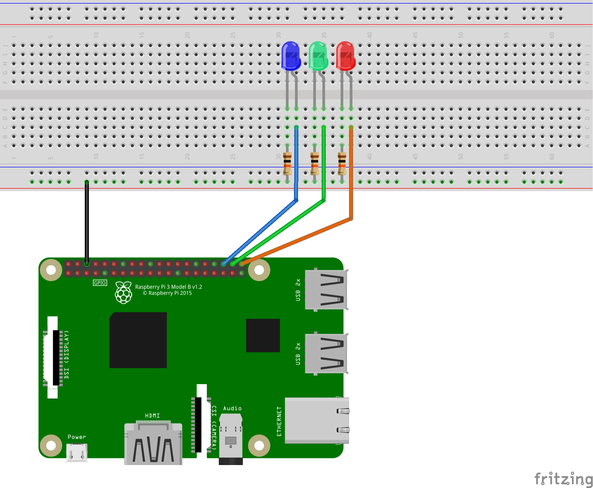

# SimpleSensors

A collection of simple scripts to control various sensors from Raspberyy Pi. I use Raspberry Pi 3 B+ with several
sensors, ADCs and Arduino.

# twosensors.py

Using MAX6675 for K-type thermocouple measurements and  DHT11 for temperature and humidity measurement. Three LEDs are used as a humidity indicator, showing low, optimal and high humidity. The data is logged in `../data` folder.

# plottwo.py

Plot last data from the `twosensors.py` logger using matplotlib and pandas.

# led.py, ledThreads.py

led.py - simple GPIO output plus GPIO.PWM to adjust LED brightness

ledThreads.py threading are used to implement PWM, just for practice. Best to replace with GPIO.PWM, the timing seems to be much better there.

